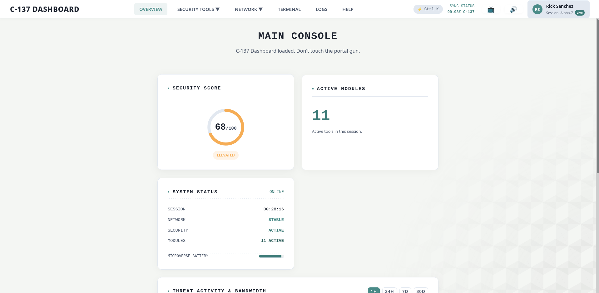

# C-137 Dashboard

A browser-based cybersecurity toolkit with a Rick and Morty-inspired interface. No backend, no frameworks, no build step. Everything runs locally using native browser APIs including the dashboard chart, which is rendered by a small built-in canvas engine (no external libraries at all).

This started as a redesign of an older project called C-137. The goal was to keep it genuinely useful while giving it a visual identity that actually makes it interesting to open.

---



---

## What it does

The dashboard gives you a set of small, self-contained security tools that you can run without installing anything or sending data anywhere. Here is what is included:

**Password Strength Checker** : Scores passwords using real entropy math (character-set pool × length), estimates crack time, and flags weak patterns — common passwords, dictionary substrings, keyboard runs, sequences, repeats, and years. Includes a show/hide toggle. Everything stays in memory.

**Password Generator** : Generates passwords using `crypto.getRandomValues()`, the browser's cryptographically secure random number generator. Guarantees at least one character from every selected set (crypto-shuffled), shows the resulting entropy in bits, and lets you pick length and character sets.

**Hash Generator** : Takes any text input and produces SHA-256, SHA-384, and SHA-512 hashes via the Web Crypto API. Updates as you type.

**Base64 Encoder / Decoder** : Two-panel layout, handles UTF-8 correctly, and lets you swap panels or copy the result with one click.

**File Identifier** : Drag and drop any file to inspect its magic bytes, hex header, entropy, and true detected type. Flags spoofed extensions (e.g. an `.exe` renamed to `.pdf`) with a warning.

**Phishing Simulator & Analyzer** : Test your detection skills against interactive email scenarios, and paste raw headers or body text into the analyzer to surface red flags — urgency keywords, IP-address links, URL shorteners, spoofed domains, and failed SPF/DKIM/DMARC checks.

**Network Lookup** : Enter an IP address or domain and it pulls basic geolocation and ISP data from a public API. Validates input, resolves domains via DNS-over-HTTPS, and times out cleanly if the lookup takes too long.

**Port Scanner** : A simulated port scan. Walks through a port range with a live progress bar, can be cancelled mid-scan, and summarizes which ports would typically be open on a given type of host. Clearly labeled as a simulation — it does not make real network connections.

**Embedded Terminal** : A command-line interface built into the dashboard. Supports `help`, `status`, `neofetch`, `tools`, `open`, `holo`, and `clear`, with command history (↑/↓) and Tab completion. You can use it to navigate to any tool.

**Command Palette** : Press `Ctrl + K` from anywhere in the app to search and jump to any tool instantly.

**Dashboard** : Security score that reacts to your activity, a live threat/bandwidth chart with time-range filters, session uptime, and a telemetry feed.

---

## Tech stack

- HTML5, CSS3, Vanilla JavaScript (ES6+)
- Web Crypto API for hashing and secure password generation
- Custom canvas chart engine (`js/chart.js`)  zero JavaScript dependencies
- LocalStorage for activity logging and session state
- Fetch API (with timeout + input validation) for the network lookup tool only
- No build step, no npm, no external scripts or CDNs

## Running it

Clone the repo and open `index.html` in any modern browser. That is it.

If you want to run it through a local server instead (which some browsers prefer for certain APIs), a simple one-liner works fine:

```bash
python3 -m http.server
```

Then go to `http://localhost:8000`.

## Project structure

```
C-137/
├── index.html
├── assets/
│   └── images/
├── css/
│   ├── main.css
│   ├── dashboard.css
│   └── components.css
├── js/
│   ├── app.js          # navigation, palette, dashboard state
│   ├── audio.js         # WebAudio synth for UI sounds
│   ├── chart.js         # dependency-free canvas chart engine
│   ├── dashboard.js     # score, telemetry, chart wiring
│   ├── terminal.js       # embedded CLI
│   ├── utils.js         # storage, toasts, clipboard, logging
│   └── tools/
│       ├── password.js   # entropy + pattern analysis
│       ├── generator.js  # crypto-random password generation
│       ├── hash.js       # SHA-256/384/512
│       ├── encoding.js   # Base64 + UTF-8
│       ├── magic.js      # file magic-byte identification
│       ├── phishing.js   # scenarios + header analyzer
│       ├── ip.js         # IP/domain lookup
│       └── scanner.js    # port scan simulation
└── pages/
    └── about.html
```

## Privacy

There is no server, no analytics, no tracking, and no third-party scripts. The only outbound requests the app can ever make are from the IP/domain lookup tool, which contacts a public DNS and geolocation API only when you explicitly click the lookup button. Everything else  hashing, generation, file analysis, phishing analysis, the chart, the terminal  is entirely local.

## Accessibility

- Keyboard navigation throughout, including the command palette and dropdown menus
- `aria-expanded` state on menus, labeled inputs and controls
- Respects `prefers-reduced-motion` for all animations
- Responsive layout with a mobile menu for small screens

## License

MIT — see [LICENSE](LICENSE) for details.
